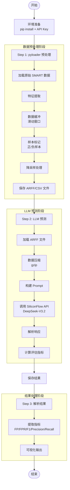
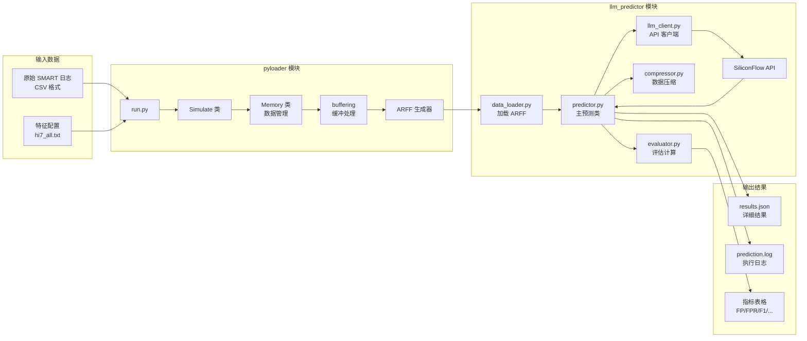
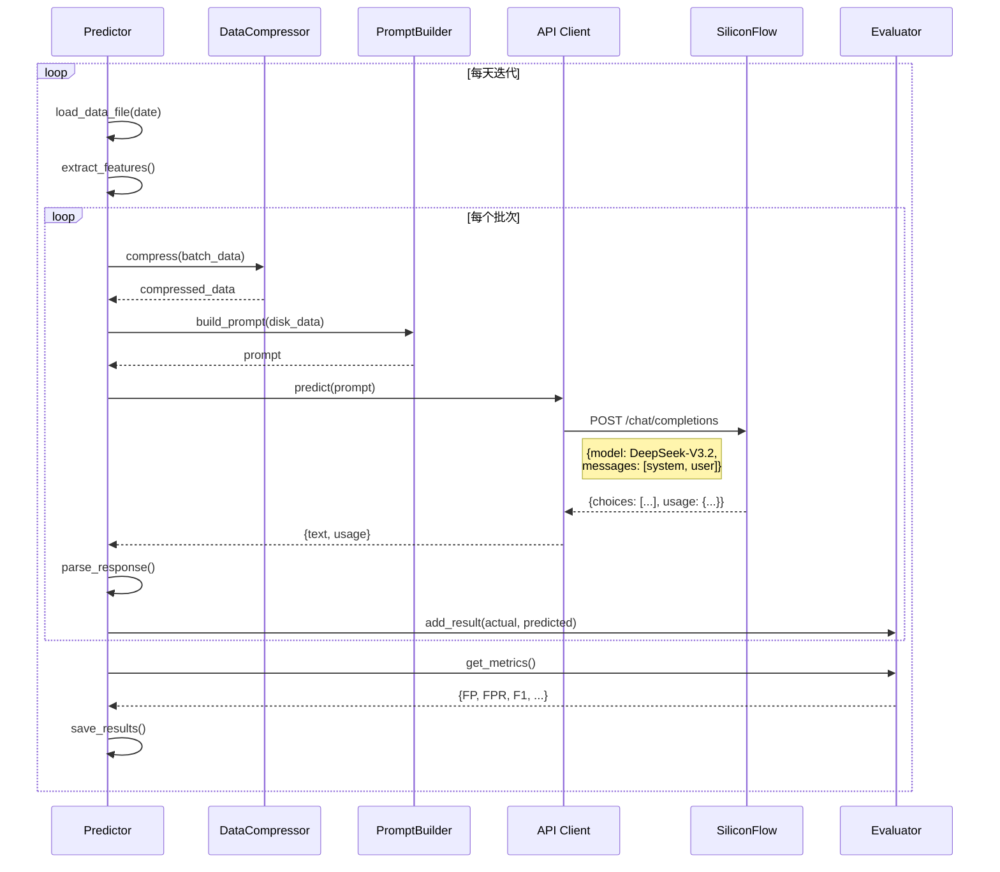
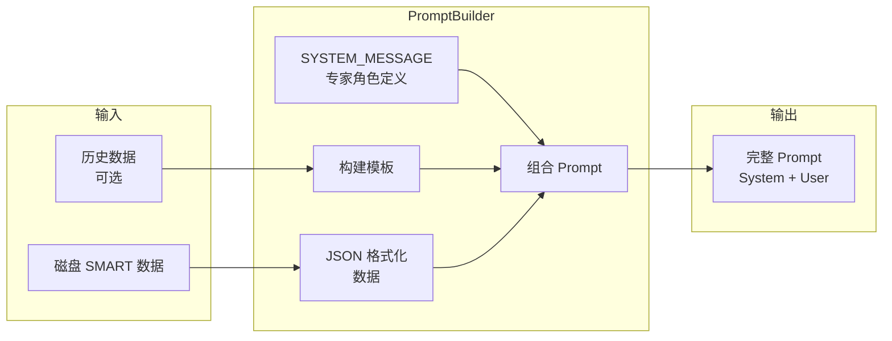
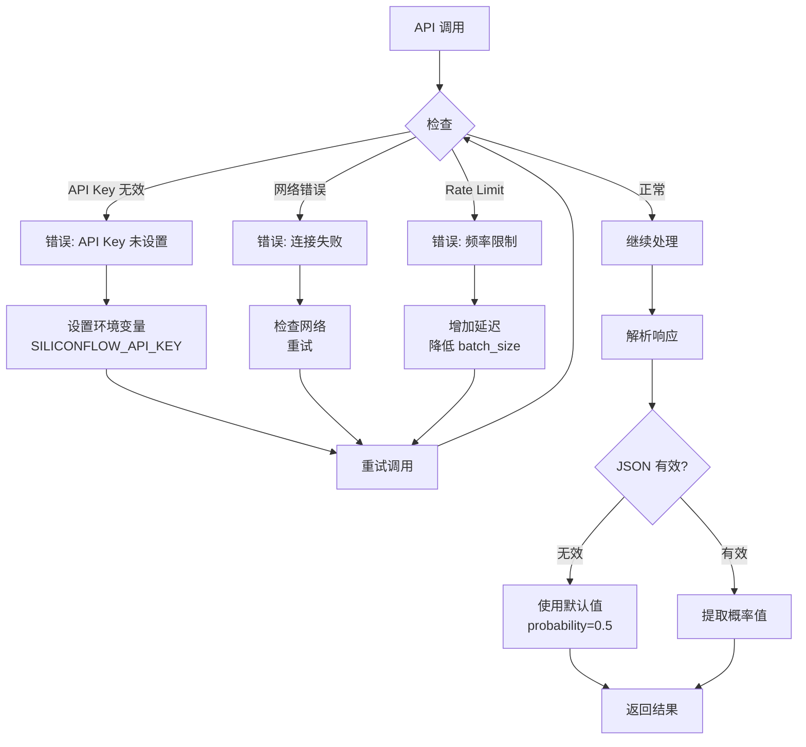
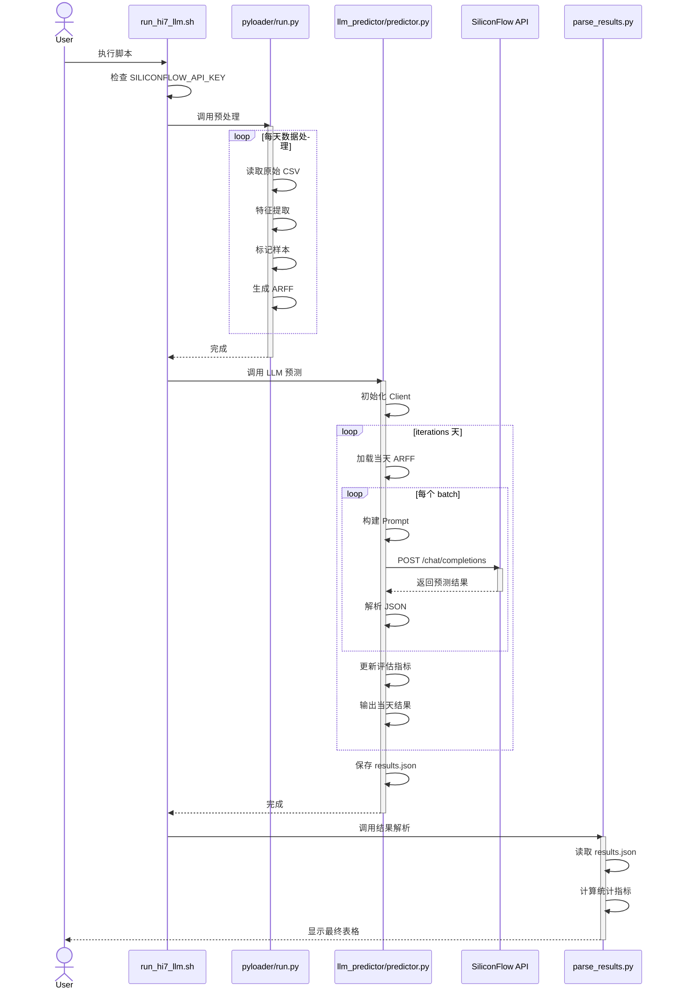
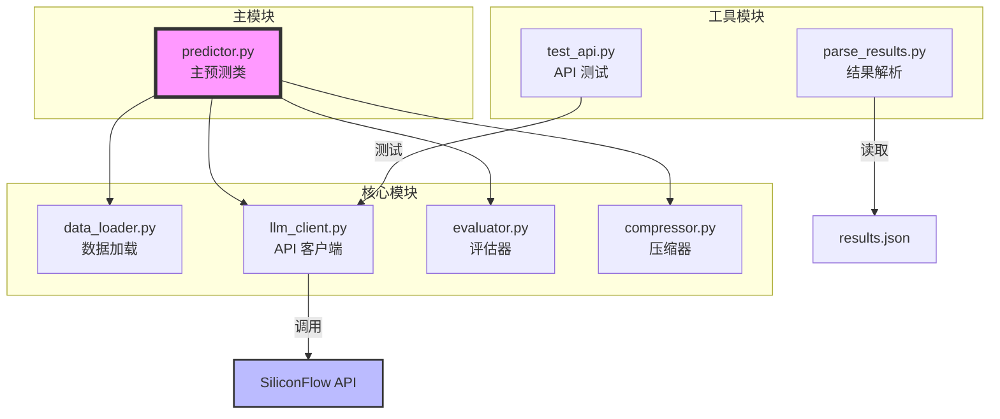
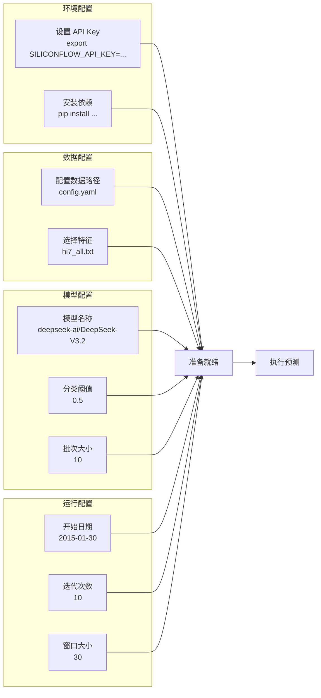

# LLM Predictor 执行流程图

## 1. 整体流程图



## 2. 详细数据流图



## 3. LLM API 调用详细流程



## 4. 评估指标计算流程

```mermaid
flowchart TD
    Start[开始评估] --> Confusion[构建混淆矩阵]
    
    subgraph ConfusionMatrix [混淆矩阵]
        TP[TP<br/>预测故障<br/>实际故障]
        FP[FP<br/>预测故障<br/>实际正常]
        TN[TN<br/>预测正常<br/>实际正常]
        FN[FN<br/>预测正常<br/>实际故障]
    end
    
    Confusion --> TP & FP & TN & FN
    
    TP & FP --> Precision[Precision = TP / (TP + FP)]
    TP & FN --> Recall[Recall = TP / (TP + FN)]
    FP & TN --> FPR[FPR = FP / (FP + TN)]
    
    Precision & Recall --> F1[F1 = 2 * P * R / (P + R)]
    
    F1 & FPR --> Output[输出指标表格]
```

## 5. Prompt 构建流程



## 6. 错误处理流程



## 7. 完整执行时序图



## 8. 模块依赖关系



## 9. 配置流程




class MultiLLMPredictor:
    def __init__(self, d_model,num_heads,dropout):
        super().__init__()

        assert d_model % num_heads == 0

        self.d_model = d_model
        self.num_heads = num_heads
        self.d_k = d_model // num_heads

        self.w_q = nn.Linear(d_model, d_model)
        self.w_k = nn.Linear(d_nodel, d_model)
        self.w_v = nn.Linear(d_model, d_model)
        self.w_o = nn.Linear(d_model, d_model)

        self.attention = nn.MultiheadAttention(d_model, num_heads, dropout=dropout)


